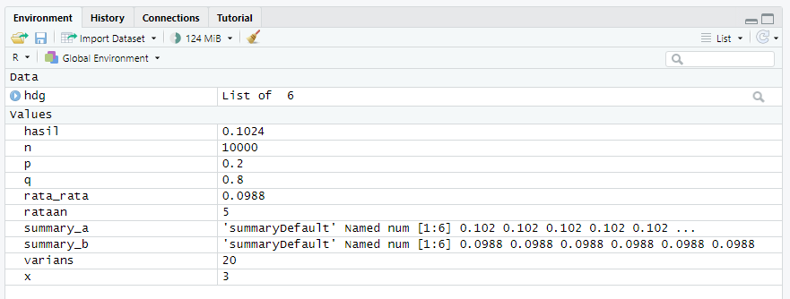
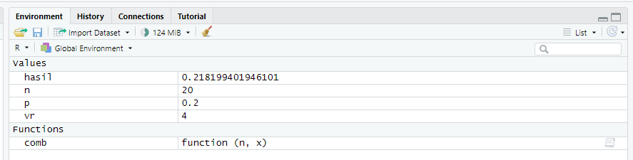
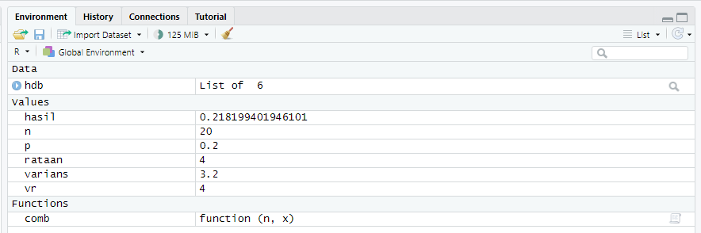
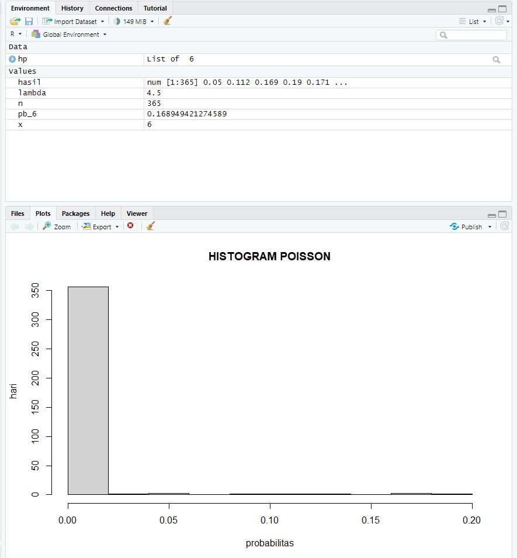
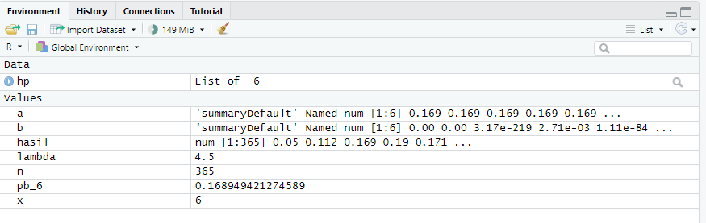
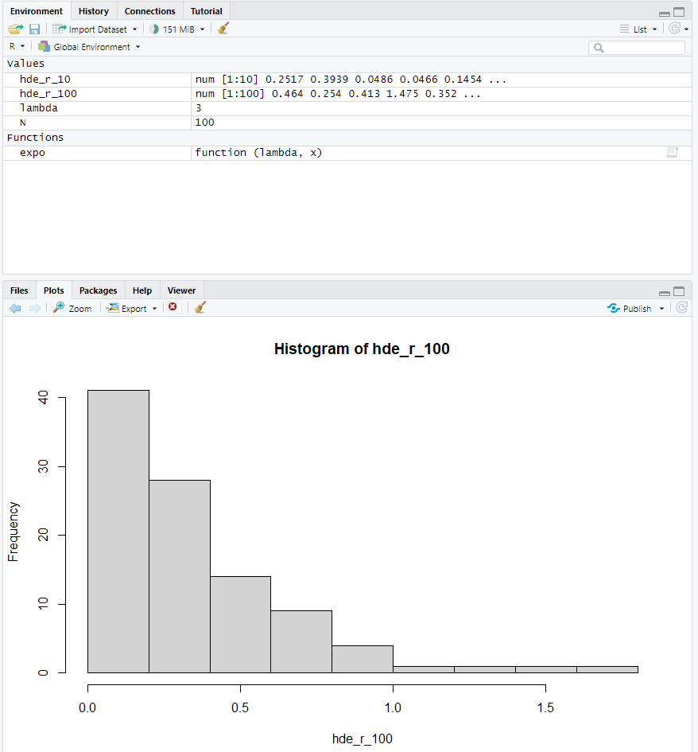
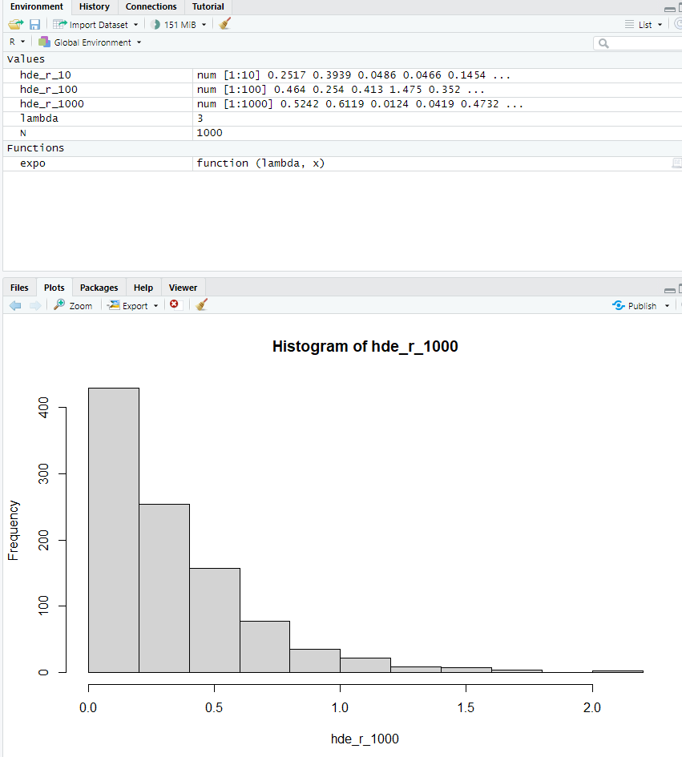

# P1_Probstat_E_5025201241

| Nama                      | NRP        |
|---------------------------|------------|
| Jabalnur                  | 5025201241 |

## Soal 1
> Seorang penyurvei secara acak memilih orang-orang di jalan sampai dia bertemu dengan seseorang yang menghadiri acara vaksinasi sebelumnya.
 - Berapa peluang penyurvei bertemu x = 3 orang yang tidak menghadiri acara vaksinasi sebelum keberhasilan pertama ketika p = 0.20 dari populasi menghadiri acara vaksinasi?
 ```R
    # a
    x <- 3
    p <- 0.2    
    q <- 1 - p
    hasil <- dgeom(x, p)
 ```
 
 
 
 - mean Distribusi Geometrik dengan 10000 data random , prob = 0,20 dimana distribusi geometrik acak tersebut X = 3 ( distribusi geometrik acak () == 3 ) 
 ```R
    # b
    rata_rata = mean(rgeom(n = 10000, prob = p) == 3)
 ```
 
 
 
 - Bandingkan Hasil poin a dan b , apa kesimpulan yang bisa didapatkan?
  
  ```R
    # c
    summary_a = summary(hasil)
    summary_b = summary(rata_rata)
  ```
  
  
  
 - Histogram Distribusi Geometrik , Peluang X = 3 gagal Sebelum Sukses Pertama
  
  ```R
    # d 
    n = 10000
    hdg = hist(rgeom(n, prob = p), main = 'Histogram Geometrik')
  ```
  
  
  
 - Nilai Rataan (μ) dan Varian (σ2) dari Distribusi Geometrik.
   
   ```R
    # e
    rataan <- 1/p
    varians <- (1-p)/p^2
   ```
   
   
   
   
## Soal 2
  > Terdapat 20 pasien menderita Covid19 dengan peluang sembuh sebesar 0.2. Tentukan :

   ```R
      n <- 20  
      p <- 0.2
   ```
   
   - Peluang terdapat 4 pasien yang sembuh.
      
      ```R

        # a
        vr <- 4
        comb <- function(n, x) {
          factorial(n) / factorial(n-x) / factorial(x)
        }
        hasil <- comb (n, vr) * p^vr * (1 - p)^(n - vr)

      ```

      
   
   - Gambarkan grafik histogram berdasarkan kasus tersebut.
   
    
      ```R
        # b
        hdb = hist(rbinom(vr, n, prob = p), xlab = "X", ylab = "Frekuensi",main = "Histogram Distribusi binomial")
      ```

      
    
   - Nilai Rataan (μ) dan Varian (σ2) dari Distribusi Binomial.
    
    
      ```R
        # c
        rataan <- n * p
        varians <- n * p * (1-p)
      ```

      
    
## soal 3
  > Diketahui data dari sebuah tempat bersalin di rumah sakit tertentu menunjukkan rata-rata historis
  4,5 bayi lahir di rumah sakit ini setiap hari. (gunakan Distribusi Poisson)
  
  ```R
     lambda <- 4.5
     
  ```
  
  
   - Berapa peluang bahwa 6 bayi akan lahir di rumah sakit ini besok?
    
      ```R
         # a
         x <- 6
         pb_6 = ppois(x, lambda = lambda, lower = FALSE)

      ```
     
      
    
   - simulasikan dan buatlah histogram kelahiran 6 bayi akan lahir di rumah sakit ini selama
  setahun (n = 365)
    
      ```R
        # b
        x <- 6
        n <- 365
        hasil <- dpois(1:365, lambda = lambda, log=FALSE)
        hp = hist(hasil, xlab = "probabilitas", ylab = "hari", main = 'HISTOGRAM POISSON')
      ```

      
    
   - dan bandingkan hasil poin a dan b , Apa kesimpulan yang bisa didapatkan
    
      ```R
         # c
         a <- summary(pb_6)
         b <- summary(hasil)
      ```

      
    
   - Nilai Rataan (μ) dan Varian (σ2) dari Distribusi Poisson.
    
      ```R
         # d
        rataan <- varians <- lambda
      ```

      
    
## soal 4
> Diketahui nilai x = 2 dan v = 10. Tentukan:
  
  ```R
    x <- 2
    v <- 10
  ```
   - Fungsi Probabilitas dari Distribusi Chi-Square.
    
      ```R
        # a
        hasil <- dchisq(x, v, ncp = 0, log = FALSE)
      ```

      
   
   - Histogram dari Distribusi Chi-Square dengan 100 data random.
    
      ```R
        # b
        set.seed(100)
        curve(result <- rchisq(x, v, ncp = 0), from = 0, to = 100 ,xlab='x', ylab="v", main="HISTOGRAM POISSON")
      ```

      
    
   - Nilai Rataan (μ) dan Varian (σ2) dari Distribusi Chi-Square.
      ```R
        # c
        rataan <- v
        varians <- 2 * v
      ```

      
 
## soal 5
> Diketahui bilangan acak (random variable) berdistribusi exponential (λ = 3). Tentukan
  
  ```R
    lambda <- 3
  ```
  
   - Fungsi Probabilitas dari Distribusi Exponensial

     ```R
       # a
       expo <- function (lambda, x){
       if (lambda > 0) {
         return((1/lambda) * exp(x/lambda*-1))
       }
         return (0)
       }
     ```
     
     

   - Histogram dari Distribusi Exponensial untuk 10, 100, 1000 dan 10000 bilangan random

       ```R
         # b
         set.seed(1)
         N <- 10
         hde_r_10 = rexp(N, lambda)
         hist(hde_r_10)
       ```

       

       ```R
         N <- 100
         hde_r_100 = rexp(N, lambda)
         hist(hde_r_100)
       ```

       

       ```R
         N <- 1000
         hde_r_1000 = rexp(N, lambda)
         hist(hde_r_1000)
       ```

       

       ```R
         N <- 10000
         hde_r_10000 = rexp(N, lambda)
         hist(hde_r_10000)
       ```

       

    - Nilai Rataan (μ) dan Varian (σ2) dari Distribusi Exponensial untuk n = 100 dan λ = 3

       ```R
         # c
         rataan <- lambda
         varians <- lambda^2
       ```

       
     
## soal 6
> Diketahui generate random nilai sebanyak 100 data, mean = 50, sd = 8. Tentukan
  
  ```R
    n <- 100
    m <- 50
    std_deviasi <- 8
  ```
  
  - Fungsi Probabilitas dari Distribusi Normal P(X1 ≤ x ≤ X2), hitung Z-Score Nya dan plot
  data generate randomnya dalam bentuk grafik. Petunjuk(gunakan fungsi plot()).

      ```R
       # a
        set.seed(100)
        random <- rnorm(100)
        rata_rata <- mean(random)
        x1 <- floor(rata_rata)
        x2 <- ceiling(rata_rata)

        z1 <- (x1 - m) / std_deviasi
        z2 <- (x2 - m) / std_deviasi

        grafik_rnorm = rnorm(n = 100, mean = m, sd = std_deviasi)
        plot(grafik_rnorm)
      ```

      

  - Generate Histogram dari Distribusi Normal dengan breaks 50 dan format penamaan:

      ```R
       # b
       hist(grafik_rnorm, xlab="x", ylab="y" ,breaks = 50, main = "5025201241_Jabalnur_E_DNhistogram")
      ```

      

  - Nilai Varian (σ2) dari hasil generate random nilai Distribusi Normal.

      ```R
       # c
       varians <- std_deviasi ** 2
      ```

      
      
